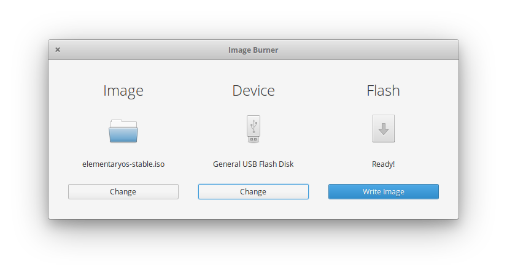

  <h1 align="center">Imageburner</h1>
  <h3 align="center">A simple imageburner inspired by Etcher's UI</h3>
  
Designed for <a href="https://elementary.io">elementary OS

  

  

## Donations
If you liked _Image Burner_, and would like to support it's development of this app and more, consider [buying me a coffee](https://www.paypal.me/ArtemAnufrij) :)

## Installation
You'll need the following dependencies:
* cmake
* cmake-elementary
* debhelper
* libgranite-dev
* valac
